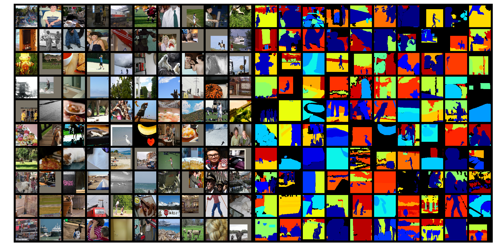

# DeepLab with PyTorch

Unofficial implementation to train **DeepLab v2 (ResNet-101)** on **COCO-Stuff 10k** dataset. DeepLab is one of the CNN architectures for semantic image segmentation. COCO Stuff 10k is a semantic segmentation dataset, which includes 10k images from 182 thing/stuff classes (+ unlabeled).

## Preparation

### Requirements

* python 2.7/3.6
* pytorch
  * pytorch 0.4.0
  * torchvision
  * [tnt](https://github.com/pytorch/tnt)
* cv2 >= 3.0.0
* [tensorboardX](https://github.com/lanpa/tensorboard-pytorch) >= 1.0
* tqdm
* click
* addict
* [pydensecrf](https://github.com/lucasb-eyer/pydensecrf) (for CRF)
* h5py (for COCO-Stuff v1.0)
* scipy (for COCO-Stuff v1.1)

### Dataset

1. Download [COCO-Stuff 10k](https://github.com/nightrome/cocostuff10k#dataset) dataset and unzip it.
1. Set the path to the dataset in ```config/cocostuff.yaml```.

```sh
cocostuff-10k-v1.1
├── images
│   ├── COCO_train2014_000000000077.jpg
│   └── ...
├── annotations
│   ├── COCO_train2014_000000000077.mat
│   └── ...
└── imageLists
    ├── all.txt
    ├── test.txt
    └── train.txt
```

### Caffemodel

1. Download [init.caffemodel](http://liangchiehchen.com/projects/DeepLabv2_resnet.html) pre-trained on MSCOCO dataset and move it to ```data/models/deeplab_resnet101/coco_init/```.
1. Convert the caffemodel to pytorch compatible. No need to build the official deeplab!

```sh
# This generates deeplabv2_resnet101_COCO_init.pth
python convert.py --dataset coco_init
```
You can also convert an included ```train2_iter_20000.caffemodel``` for Pascal VOC 2012 dataset. See ```convert.py```.

## Training

```sh
# Training
python train.py --config config/cocostuff.yaml
```

```sh
# Monitoring
tensorboard --logdir runs
```

### Default settings

```config/cocostuff.yaml```

- All the GPUs visible to the process are used. Please specify the scope with ```CUDA_VISIBLE_DEVICES=```.
- Stochastic gradient descent (SGD) is used with momentum of 0.9 and initial learning rate of 2.5e-4. Polynomial learning rate decay is employed; the learning rate is multiplied by ```(1-iter/max_iter)**power``` at every 10 iterations.
- Weights are updated 20k iterations with mini-batch of 10. The batch is not processed at once due to high occupancy of video memories, instead, gradients of small batches are aggregated, and weight updating is performed at the end (```batch_size * iter_size = 10```).
- Input images are initially warped to 513x513, randomly re-scaled by factors ranging from 0.5 to 1.5, zero-padded if needed, and randomly cropped to 321x321 so that the input size is fixed during training (see the example below).
- Loss is defined as a sum of responses from multi-scale inputs (1x, 0.75x, 0.5x) and element-wise max across the scales. The "unlabeled" class (index -1) is ignored in the loss computation.
- Moving average loss (```average_loss``` in Caffe) can be monitored in TensorBoard (please specify a log directory, e.g., ```runs```).
- GPU memory usage is approx. 11.2 GB with the default setting (tested on the single Titan X). You can reduce it with a small ```batch_size```.

Please use ```config/cocostuff2.yaml``` to preserve aspect ratio in the image preprocessing.

### Processed image vs. label examples



## Evaluation

```sh
python eval.py --config config/cocostuff.yaml \
               --model-path <PATH TO MODEL>
```

You can run CRF post-processing with a option ```--crf```. See ```--help``` for more details.

## Performance

After 20k iterations with a mini-batch of 10 ([trained model files](https://drive.google.com/file/d/10NZLpcidO1hNB5yBxYJpXneApxYmObGD/view?usp=sharing))

||CRF?|Pixel Accuracy|Mean Accuracy|Mean IoU|Frequency Weighted IoU|
|:-:|:-:|:-:|:-:|:-:|:-:|
|[Official report](https://github.com/nightrome/cocostuff10k)|No|65.1%|45.5%|34.4%|50.4%|
|DeepLab v2|No|64.8%|45.1%|33.8%|50.1%|
|DeepLab v2|Yes|66.3%|45.8%|34.9%|51.6%|

## Demo

### From an image

```bash
python demo.py --config config/cocostuff.yaml \
               --model-path <PATH TO MODEL> \
               --image-path <PATH TO IMAGE>
```

### From a web camera

```bash
python livedemo.py --config config/cocostuff.yaml \
                   --model-path <PATH TO MODEL> \
                   --camera-id <CAMERA ID>
```

## References

* [DeepLab: Semantic Image Segmentation with Deep Convolutional Nets, Atrous Convolution, and Fully Connected CRFs](https://arxiv.org/abs/1606.00915)<br>
L. C. Chen, G. Papandreou, I. Kokkinos et al.,<br>
In arXiv preprint arXiv:1606.00915, 2016.

* [COCO-Stuff: Thing and Stuff Classes in Context](https://arxiv.org/abs/1612.03716)<br>
H. Caesar, J. Uijlings, V. Ferrari,<br>
In CVPR, 2018.